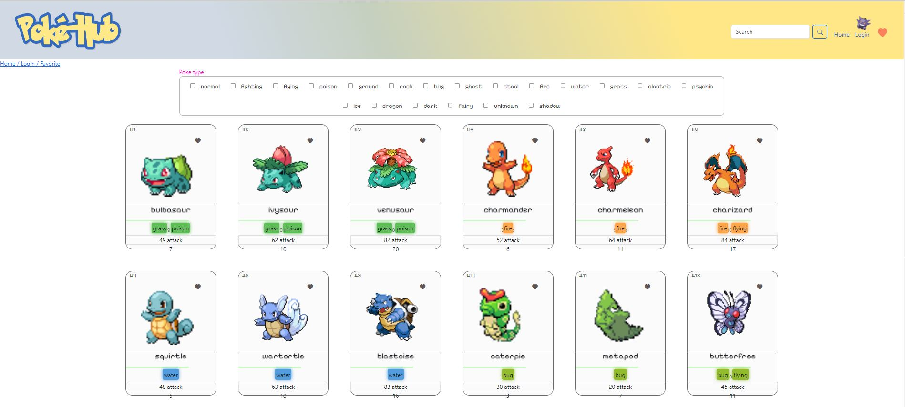
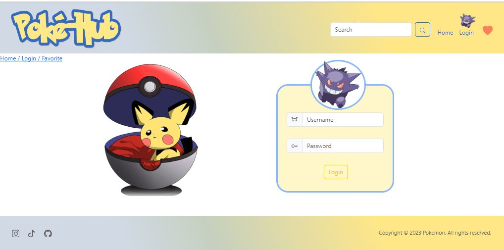
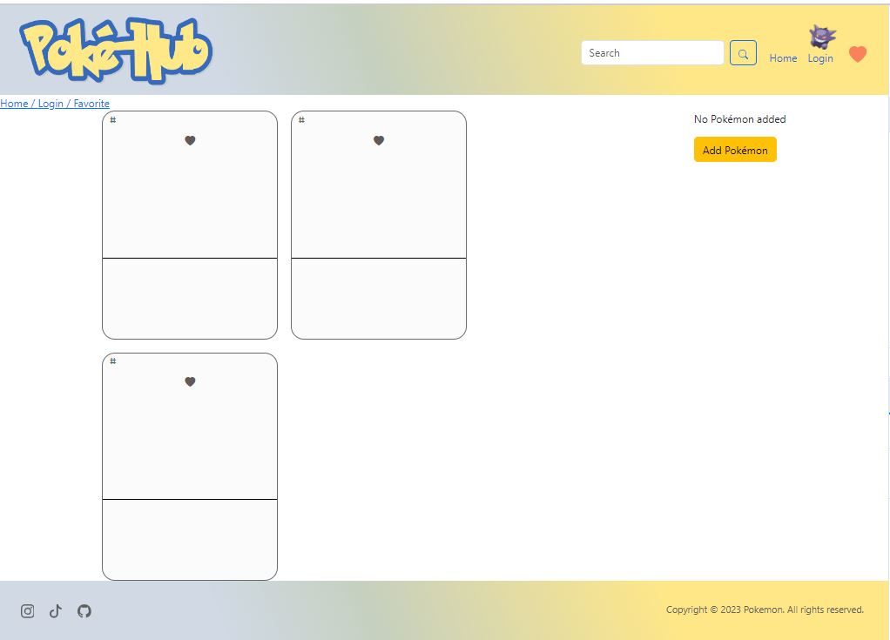
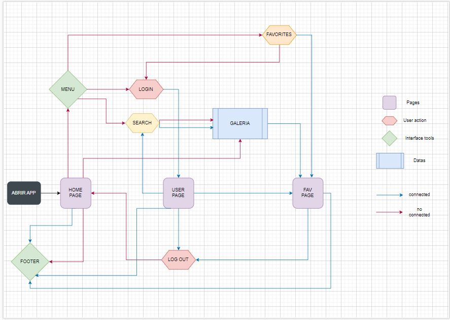

# pokeApi

This template should help get you started developing with Vue 3 in Vite.

## Recommended IDE Setup

[VSCode](https://code.visualstudio.com/) + [Volar](https://marketplace.visualstudio.com/items?itemName=Vue.volar) (and disable Vetur) + [TypeScript Vue Plugin (Volar)](https://marketplace.visualstudio.com/items?itemName=Vue.vscode-typescript-vue-plugin).

## Customize configuration

See [Vite Configuration Reference](https://vitejs.dev/config/).

## Project Setup

```sh
npm install
```

### Compile and Hot-Reload for Development

```sh
npm run dev
```

### Compile and Minify for Production

```sh
npm run build
```

### Run Unit Tests with [Vitest](https://vitest.dev/)

```sh
npm run test:unit
```

# POKEAPI

## CONTEXTO DEL PROYECTO

Varias empresas de diferentes ámbitos nos han encargado una SPA (Single Page Application).

### Requisitos:

SPA con Vue
Responsive Design
Homepage con su header, footer y sección principal con la lista de los elementos los cuales podrán ser agregados a la vista de favoritos
Sección de favoritos (Para acceder a ella se deberá pasar por una sección de login)
En la página de favoritos se podrá suprimir los elementos agregados, modificar el título y/o contenido así como valorar mediante un metodo de valoración cada uno de los elementos.
En la página de favoritos también debemos tener la opción de agregar un elemento
Agregar la paginación de elementos
Tener la posibilidad de filtrar o buscar los elementos deseados
Posibilidad de cambiar la imagen de un elemento
<div align = "center">
&nbsp;
&nbsp;
&nbsp;
&nbsp;
</div>

## USER FLOW

<p align="center">
  
</p>

### LENGUAJES Y HERRAMIENTAS UTILIZADAS
<div>
    &nbsp;
    &nbsp;
    &nbsp;
    &nbsp;
    &nbsp;
    &nbsp;
    &nbsp;
    &nbsp;
    &nbsp;
</div>

### COLABORADORES :family:

-[Stella González](https://github.com/Stegonyrob) 
-[Luis Pardo](https://github.com/luispardosuarez) 
-[Romina Ruiz](https://github.com/rominaruizdiaz) 
-[Alicia González](https://github.com/Aliglez) 


